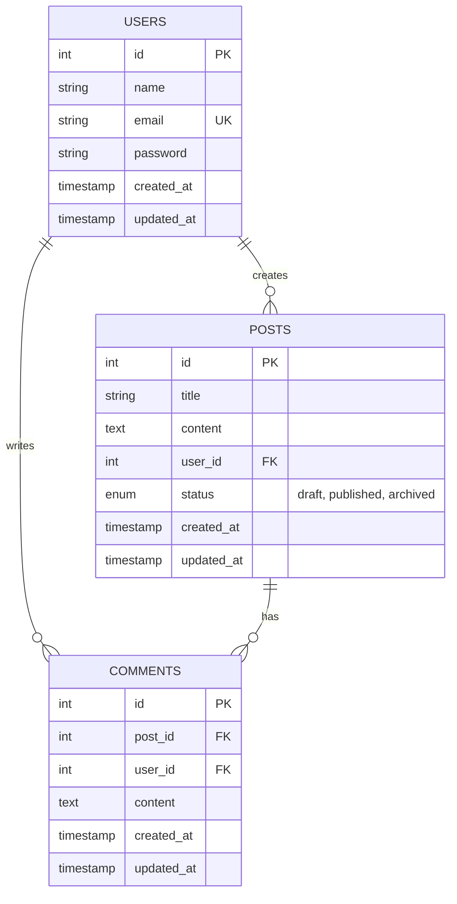

# CodeIgniter 4 CRUD Application

A simple yet powerful CRUD API built with CodeIgniter 4, featuring user authentication via JWT and full post/comment management.

## Features

- User Authentication & Registration with JWT
- Post Management (Create, Read, Update, Delete)
- Comment System for Posts
- Timestamps for all entities
- Input Validation
- RESTful API Design

## Database Schema



## API Documentation

### Authentication Endpoints

#### Register User

```
POST /api/auth/register
Content-Type: application/json

Request:
{
  "name": "John Doe",
  "email": "john@example.com",
  "password": "securepassword123"
}

Response: 201 Created
{
  "message": "User registered successfully",
  "user": { ... }
}
```

#### Login

```
POST /api/auth/login
Content-Type: application/json

Request:
{
  "email": "john@example.com",
  "password": "securepassword123"
}

Response: 200 OK
{
  "token": "eyJhbGc...",
  "user": { ... }
}
```

### Post Endpoints

#### Get All Posts

```
GET /api/posts?page=1

Response: 200 OK
{
  "data": [
    {
      "id": 1,
      "title": "First Post",
      "content": "Post content...",
      "author_name": "John Doe",
      "status": "published",
      "created_at": "2024-01-15 10:30:00"
    }
  ],
  "pagination": {
    "total": 10,
    "per_page": 10,
    "current_page": 1,
    "last_page": 1
  }
}
```

#### Get Post with Comments

```
GET /api/posts/{id}

Response: 200 OK
{
  "id": 1,
  "title": "First Post",
  "content": "Post content...",
  "author_name": "John Doe",
  "status": "published",
  "comments": [
    {
      "id": 1,
      "content": "Great post!",
      "commenter_name": "Jane Doe",
      "created_at": "2024-01-15 11:00:00"
    }
  ],
  "created_at": "2024-01-15 10:30:00"
}
```

#### Create Post (Protected)

```
POST /api/posts
Authorization: Bearer {token}
Content-Type: application/json

Request:
{
  "title": "New Post",
  "content": "Post content goes here",
  "user_id": 1,
  "status": "published"
}

Response: 201 Created
{
  "message": "Post created successfully",
  "post": { ... }
}
```

#### Update Post (Protected)

```
PUT /api/posts/{id}
Authorization: Bearer {token}
Content-Type: application/json

Request:
{
  "title": "Updated Title",
  "content": "Updated content",
  "status": "archived"
}

Response: 200 OK
{
  "message": "Post updated successfully",
  "post": { ... }
}
```

#### Delete Post (Protected)

```
DELETE /api/posts/{id}
Authorization: Bearer {token}

Response: 200 OK
{
  "message": "Post deleted successfully"
}
```

### Comment Endpoints

#### Add Comment (Protected)

```
POST /api/posts/{postId}/comments
Authorization: Bearer {token}
Content-Type: application/json

Request:
{
  "user_id": 2,
  "content": "Great post!"
}

Response: 201 Created
{
  "message": "Comment created successfully",
  "comment": { ... }
}
```

#### Update Comment (Protected)

```
PUT /api/posts/{postId}/comments/{commentId}
Authorization: Bearer {token}
Content-Type: application/json

Request:
{
  "content": "Updated comment text"
}

Response: 200 OK
{
  "message": "Comment updated successfully",
  "comment": { ... }
}
```

#### Delete Comment (Protected)

```
DELETE /api/posts/{postId}/comments/{commentId}
Authorization: Bearer {token}

Response: 200 OK
{
  "message": "Comment deleted successfully"
}
```

## Installation & Setup

1. Clone the repository and install dependencies:

    ```bash
    composer install
    ```

2. Copy `.env` file and configure database:

    ```bash
    cp env .env
    ```

3. Set your `baseURL` and database credentials in `.env`

4. Generate application key:

    ```bash
    php spark key
    ```

5. Run migrations:
    ```bash
    php spark migrate
    ```

## Running the Application

Start the development server:

```bash
php spark serve
```

Access the API at `http://localhost:8080/api`
